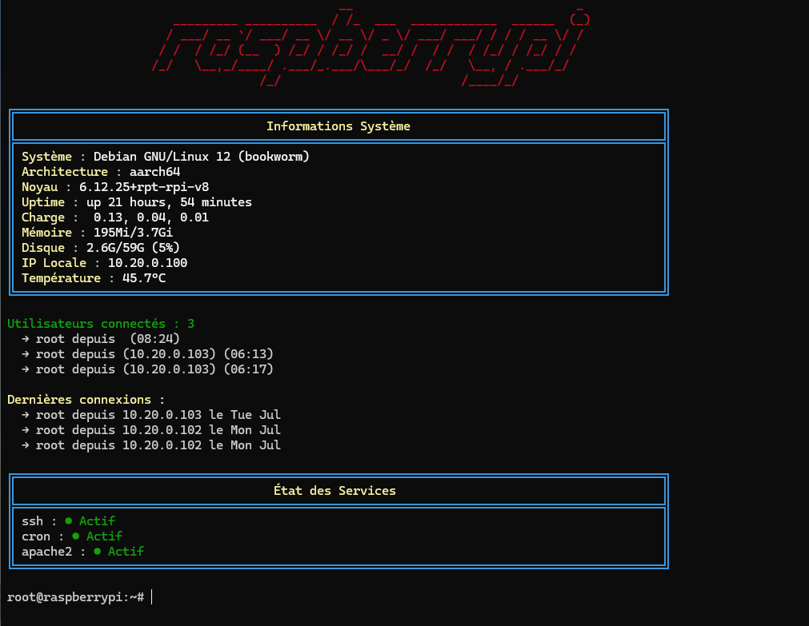

# MOTD-AARCH64

Un système MOTD (Message of the Day) moderne et configurable spécialement conçu pour les architectures ARM64/aarch64.



*Aperçu du MOTD-AARCH64 en action*

## Fonctionnalités

- 🎨 **Interface moderne** avec bordures et couleurs personnalisables
- 🔧 **Configuration interactive** via menu graphique
- 📊 **Informations système** complètes (CPU, mémoire, disque, température)
- 🛠️ **Surveillance des services** configurable
- 🌈 **Thèmes de couleurs** multiples
- 🔧 **Optimisé pour ARM64** (Raspberry Pi, etc.)

## Installation rapide

```bash
# Télécharger et installer
curl -fsSL https://raw.githubusercontent.com/alphagoones/motd-aarch64/main/scripts/install.sh | sudo bash

# Ou cloner le dépôt
git clone https://github.com/alphagoones/motd-aarch64.git
cd motd-aarch64
sudo ./install.sh
```

## Utilisation

### Installation complète
```bash
sudo ./install.sh
```

### Reconfiguration
```bash
sudo ./install.sh --configure
```

### Désinstallation
```bash
sudo ./install.sh --uninstall
```

### Test manuel
```bash
sudo run-parts /etc/update-motd.d/
```

## Configuration

Le script d'installation propose une configuration interactive qui permet de :

### Informations système
- ✅ Nom du système et distribution
- ✅ Architecture et version du noyau
- ✅ Temps de fonctionnement et charge
- ✅ Utilisation mémoire et disque
- ✅ Adresse IP locale
- ✅ Température CPU (si disponible)
- ✅ Utilisateurs connectés
- ✅ Dernières connexions
- ✅ Mises à jour disponibles

### Surveillance des services
Le script détecte automatiquement les services installés et vous permet de sélectionner ceux à surveiller :
- SSH
- Apache2/Nginx
- Docker
- Fail2Ban
- UFW
- PostgreSQL/MySQL
- Redis/MongoDB
- Et bien d'autres...

### Thèmes de couleurs
- **Défaut** : Multicolore (bleu/cyan/jaune)
- **Bleu** : Variations de bleu
- **Vert** : Variations de vert
- **Rouge** : Variations de rouge

## Structure du projet

```
motd-aarch64/
├── install.sh              # Script d'installation principal
├── README.md               # Documentation
├── LICENSE                 # Licence
├── .gitignore             # Fichiers ignorés par Git
└── examples/              # Exemples et captures d'écran
    ├── screenshot1.png
    └── screenshot2.png
```

## Fichiers générés

Après installation, les fichiers suivants sont créés :

```
/etc/motd-aarch64/
├── config                  # Configuration générale
├── system_info            # Informations système activées
└── services               # Services à surveiller

/etc/update-motd.d/
├── 00-motd-aarch64        # Script principal MOTD
└── 10-motd-services       # Script surveillance services
```

## Personnalisation avancée

### Modification manuelle de la configuration

```bash
# Éditer la configuration générale
sudo nano /etc/motd-aarch64/config

# Éditer les informations système
sudo nano /etc/motd-aarch64/system_info

# Éditer les services surveillés
sudo nano /etc/motd-aarch64/services
```

### Ajout de services personnalisés

```bash
# Ajouter un service à surveiller
echo "mon-service-custom" | sudo tee -a /etc/motd-aarch64/services
```

## Compatibilité

- **Architecture** : Optimisé pour aarch64/ARM64
- **Système** : Debian, Ubuntu et dérivés
- **Matériel** : Raspberry Pi, Orange Pi, autres SBC ARM
- **Prérequis** : SystemD, APT package manager

## Exemples d'affichage

### Affichage principal
```
     ██████╗ ██████╗ ███████╗███████╗██████╗ ██╗   ██╗
    ██╔════╝██╔═══██╗██╔════╝██╔════╝██╔══██╗╚██╗ ██╔╝
    ██║     ██║   ██║███████╗█████╗  ██████╔╝ ╚████╔╝ 
    ██║     ██║   ██║╚════██║██╔══╝  ██╔══██╗  ╚██╔╝  
    ╚██████╗╚██████╔╝███████║███████╗██║  ██║   ██║   
     ╚═════╝ ╚═════╝ ╚══════╝╚══════╝╚═╝  ╚═╝   ╚═╝   

╔══════════════════════════════════════════════════════════════════════════════════════╗
║                                  Informations Système                                ║
╠══════════════════════════════════════════════════════════════════════════════════════╣
║ Système : Ubuntu 22.04.3 LTS                                                        ║
║ Architecture : aarch64                                                               ║
║ Noyau : 5.15.0-1028-raspi                                                          ║
║ Uptime : up 2 days, 4 hours, 23 minutes                                            ║
║ Charge :  0.15, 0.10, 0.05                                                         ║
║ Mémoire : 1.2G/3.8G                                                                ║
║ Disque : 8.1G/29G (31%)                                                            ║
║ IP Locale : 192.168.1.100                                                          ║
║ Température : 45.2°C                                                               ║
╚══════════════════════════════════════════════════════════════════════════════════════╝

Utilisateurs connectés : 1
  → pi depuis 192.168.1.50 (22:30)

Dernières connexions :
  → pi depuis 192.168.1.50 le Mar 14
  → admin depuis 192.168.1.25 le Mar 13
  → pi depuis console le Mar 12
```

### Surveillance des services
```
╔══════════════════════════════════════════════════════════════════════════════════════╗
║                                  État des Services                                   ║
╠══════════════════════════════════════════════════════════════════════════════════════╣
║ ssh : ● Actif                                                                       ║
║ docker : ● Actif                                                                    ║
║ fail2ban : ● Actif                                                                  ║
║ nginx : ● Inactif                                                                   ║
╚══════════════════════════════════════════════════════════════════════════════════════╝
```

## Dépannage

### MOTD ne s'affiche pas
```bash
# Vérifier les permissions
ls -la /etc/update-motd.d/

# Tester manuellement
sudo run-parts /etc/update-motd.d/
```

### Services non détectés
```bash
# Vérifier les services disponibles
systemctl list-unit-files --type=service
```

### Température CPU non affichée
```bash
# Vérifier les capteurs de température
ls /sys/class/thermal/thermal_zone*/temp

# Pour Raspberry Pi
/opt/vc/bin/vcgencmd measure_temp
```

### Erreur de permissions
```bash
# Réparer les permissions
sudo chmod +x /etc/update-motd.d/00-motd-aarch64
sudo chmod +x /etc/update-motd.d/10-motd-services
```

## Contribution

Les contributions sont les bienvenues ! Voici comment contribuer :

1. Forkez le projet
2. Créez une branche pour votre fonctionnalité (`git checkout -b feature/nouvelle-fonctionnalite`)
3. Committez vos changements (`git commit -am 'Ajout d'une nouvelle fonctionnalité'`)
4. Pushez vers la branche (`git push origin feature/nouvelle-fonctionnalite`)
5. Ouvrez une Pull Request

### Guidelines de contribution

- Respectez le style de code existant
- Testez sur au moins une architecture aarch64
- Documentez les nouvelles fonctionnalités
- Mettez à jour le README si nécessaire

## Licence

Ce projet est sous licence MIT. Voir le fichier [LICENSE](LICENSE) pour plus de détails.

## Changelog

### v1.0.0 (2025-07-14)
- 🎉 Version initiale
- ✨ Configuration interactive
- 🎨 Thèmes de couleurs multiples
- 📊 Informations système complètes
- 🛠️ Surveillance des services
- 🔧 Optimisation aarch64

## Auteur

Votre nom - [@alphagoones](https://github.com/alphagoones)

## Remerciements

- Communauté Raspberry Pi
- Projets de MOTD existants
- Contributeurs du projet

## Support

Si vous rencontrez des problèmes :

1. Consultez la section [Dépannage](#dépannage)
2. Cherchez dans les [Issues existantes](https://github.com/alphagoones/motd-aarch64/issues)
3. Créez une nouvelle issue avec :
   - Version du système
   - Architecture
   - Logs d'erreur
   - Étapes pour reproduire le problème

---

**Note**: Ce projet est spécialement optimisé pour les architectures ARM64, mais peut fonctionner sur d'autres architectures avec des fonctionnalités limitées.
